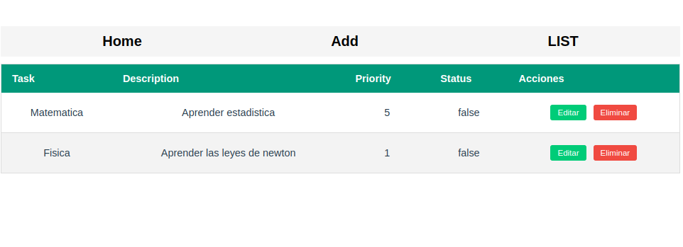

# front-todolist-vue

## Project setup
```
npm install
```

## you will need a backend to run this project

you can find the backend here:  https://github.com/jonatan-c/todolist-app-net-api

### Compiles and hot-reloads for development
```
npm run serve
```

### Compiles and minifies for production
```
npm run build
```


